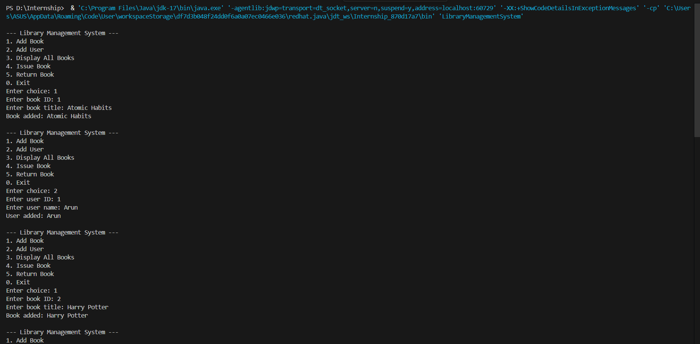

# 📚 Library Management System (Java OOP Project)

This is a simple **Library Management System** built using **Object-Oriented Programming (OOP)** in Java. It allows the user to manage books and library users through a command-line interface.

---

## 🎯 Objective

To build a mini CLI-based system that demonstrates the use of OOP concepts in Java to manage a library of books and users.

---

## 🛠️ Tools Used

- Java (JDK 8 or above)
- VS Code / IntelliJ / Any Java IDE
- Terminal / Command Prompt

---

## 🧩 Features

- Add new books 📚
- Register new users 👤
- Display all books with their availability
- Issue books to users
- Return issued books
- Exit the system gracefully

---

## 🧱 Classes Used

| Class  | Description |
|--------|-------------|
| `Book`    | Represents each book with ID, title, and issue status |
| `User`    | Represents a library user with ID and name |
| `Library` | Contains lists of books and users, and manages book issue/return |
| `LibraryManagementSystem` | The main program with a user menu and loop |

---

